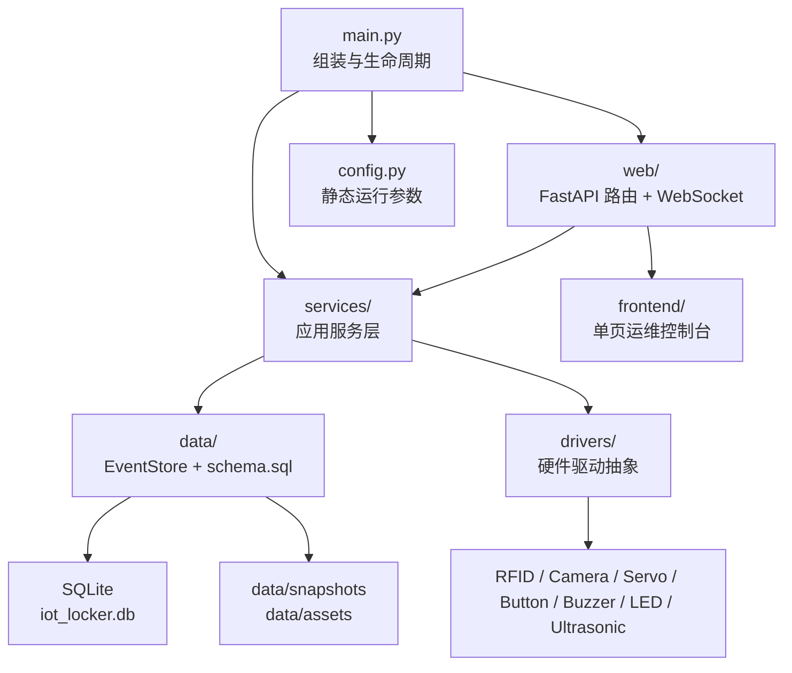

# ParcelBox / IOT Locker

`ParcelBox` 是一个部署在单台 Raspberry Pi 上的智能柜原型项目。它把 RFID、摄像头、人脸检测、舵机、超声波、按钮、蜂鸣器、RGB LED、SQLite、FastAPI 和一个原生 `HTML + CSS + JS` 运维控制台整合在同一个设备里，目标是验证“单设备、可本地运行、可直接连硬件”的完整链路。

这份 README 的目标不是只告诉你“怎么跑起来”，而是让第一次接手这个仓库的人能快速建立完整心智模型：项目分几层、每一层负责什么、核心业务流怎么跑、代码应该从哪里开始看。

## 一句话定位

- 这是一个 **单设备 IoT 原型**，不是云端多租户系统。
- 这是一个 **设备运维/调试控制台**，不是面向终端用户的产品官网。
- 视觉部分只做 **人脸检测与追踪**，不做人脸识别。
- 整个系统围绕 “**本机硬件 + 本机服务 + 本机前端**” 展开。

## 当前能力

- [x] RFID 卡录入、启停和时间窗权限控制
- [x] 门锁舵机开门 / 关门 / 自动回关
- [x] CSI 摄像头 MJPEG 实时视频流
- [x] WebSocket 人脸框叠加、追踪、待机、恢复搜索
- [x] 手动抓拍、刷卡抓拍、按钮抓拍、近距离人脸抓拍
- [x] 快照文件裁剪与数据库/文件系统对账
- [x] 超声波占用检测
- [x] 物理按钮开门请求与邮件通知
- [x] 蜂鸣器告警规则与前端通知中心联动
- [x] RGB LED 运行状态指示
- [x] SQLite 持久化事件存储与设备设置存储
- [x] 前端运维控制台：`Overview / Cards & Access / Events & Snapshots / Debug / Data / Settings`
- [x] 主题切换、设备 profile、头像、邮件方案管理
- [x] 从事件流和快照卡片打开图片查看器
- [ ] `systemd` 自启动与部署收尾
- [ ] 长时间真机 soak test
- [ ] 真实柜体上的超声波阈值校准

## 项目边界

- [x] 仅支持单设备部署
- [x] 没有登录 / 注册 / 多用户权限系统
- [x] 默认不做公网暴露安全加固
- [x] 当前视频流仍是 `MJPEG`，没有 `WebRTC / H.264`
- [x] `Tabler` 只作为布局和组件层级参考，业务前端代码全部保留在 `frontend/`

## 架构总览

### 依赖方向

项目严格按下面这个方向依赖：

`frontend -> web -> services -> (data + drivers) -> hardware / sqlite / files`

也就是说：

- 前端只调用 HTTP / WebSocket，不直接碰数据库和硬件。
- 路由层只负责协议适配，不写核心业务规则。
- 服务层是核心，负责状态、线程、硬件协调和业务编排。
- 数据层只管持久化，不关心 HTTP 或 GPIO。
- 驱动层只抽象硬件读写，不关心业务语义。

### 总体关系图



## 项目分层

这一节是整个 README 的重点。可以把这个项目理解成 6 层。

### 1. 组装与配置层

对应文件：

- `main.py`
- `config.py`

这一层解决的是“**系统怎么被装起来**”。

#### `main.py` 负责什么

`main.py` 不是业务逻辑中心，它是系统装配器：

- 创建所有单例服务对象
- 注入依赖和回调关系
- 规定启动顺序和关闭顺序
- 注册所有 FastAPI 路由
- 挂载前端静态文件目录
- 启动 `uvicorn`

它把项目里最重要的依赖关系显式写出来了。例如：

- `CameraService` 抓拍后会通知 `EventStore` 做快照文件对账
- `VisionService` 依赖 `CameraService` 提供检测帧
- `CameraMountService` 依赖 `VisionService` 的检测结果驱动云台
- `ButtonService` 会同时调用抓拍、邮件通知和告警回调
- `LockerService` 会调用 `AccessService` 做授权、调用 `OccupancyService` 做关门后占用判断
- `LedService` 会综合视觉、门锁、按钮等状态做最终灯效

如果你想先理解“这个项目谁调用谁”，第一站就是 `main.py`。

#### `config.py` 负责什么

`config.py` 保存的是 **静态运行配置**，也就是设备级默认参数：

- GPIO 引脚分配
- 摄像头分辨率、翻转、FPS、画质
- 云台角度范围、跟踪步长、待机参数
- 门锁舵机角度和自动关门时长
- RFID 轮询时间和防抖参数
- 蜂鸣器、LED、超声波阈值
- Web 服务端口
- 邮件的固定 SMTP 参数

需要注意两件事：

- `config.py` 适合放“部署时就知道、运行时很少改”的参数。
- 用户在前端改的 profile、头像、邮件方案，不写回 `config.py`，而是进入 SQLite。

这意味着本项目的配置分成两类：

- 静态配置：`config.py`
- 运行时可编辑配置：`EventStore + SQLite`

### 2. 表现层（Frontend + API / WebSocket）

对应目录：

- `frontend/`
- `web/`

这一层解决的是“**人如何和设备交互**”。

#### 2.1 前端层 `frontend/`

前端是一个 **不引入构建链的单页运维控制台**，由 FastAPI 直接静态托管。它的职责很明确：

- 展示实时视频流与视觉框
- 展示门锁、RFID、占用、系统状态
- 提供高频操作入口：开门、关门、抓拍、录卡
- 展示事件流、快照、调试表格
- 管理本机 profile、通知偏好、邮件方案

前端内部又拆成几个小层：

- `index.html`
  - 页面结构和视图容器
- `styles/theme.css`
  - 主题变量和全局视觉基线
- `styles/layout.css`
  - 页面布局骨架和响应式断点
- `styles/components.css`
  - 卡片、表格、toast、弹层、状态组件
- `scripts/dom.js`
  - 全量 DOM 引用
- `scripts/state.js`
  - 前端运行时状态、轮询/WebSocket 常量
- `scripts/api.js`
  - 所有后端接口调用
- `scripts/renderers.js`
  - 把状态渲染成页面和 overlay
- `scripts/formatters.js`
  - 时间、标签、状态文本等纯格式化逻辑
- `scripts/app.js`
  - 前端入口、事件绑定、启动流程、流重连、WebSocket 管理

这个拆法的意义是：前端虽然不用框架，但仍然有清晰分层，不会重新回到一个超长脚本文件。

#### 2.2 Web 层 `web/`

Web 层是 **协议适配层**。它的职责不是做业务，而是把服务层暴露给前端。

主要文件：

- `routes_stream.py`
  - MJPEG 视频流
  - 视觉 WebSocket
  - 手动抓拍接口
- `routes_control.py`
  - 开门、关门、告警静音、门锁状态
- `routes_cards.py`
  - 卡片列表、录卡、更新卡权限
- `routes_logs.py`
  - 事件流、数据库表快照
- `routes_snapshots.py`
  - 快照详情和图片文件下载
- `routes_settings.py`
  - profile、头像、邮件方案、测试邮件
- `routes_system.py`
  - 主机状态和进程状态
- `schemas.py`
  - Pydantic 请求模型

Web 层应该保持轻：

- 做参数校验
- 调用 service
- 把异常转成 HTTP 错误码
- 返回前端需要的 JSON 结构

它不应该：

- 直接访问 GPIO
- 直接写 SQLite
- 在路由里拼复杂业务规则

### 3. 应用服务层

对应目录：

- `services/`

这是整个项目的核心层。你可以把每个 service 看成一个“长期存活的业务组件”，它通常会负责几件事：

- 自己的状态
- 自己的线程或轮询循环
- 自己依赖的硬件对象生命周期
- 自己对外暴露的业务方法
- 把结果写入 `EventStore`

#### 3.1 核心业务服务

##### `AccessService`

职责：

- 管理 PN532 RFID 读卡器生命周期
- 维护授权卡数据
- 支持录卡、更新卡、查询卡
- 在刷卡时判断是否允许访问
- 校验卡是否启用、是否在访问时间窗内
- 提供“检测到卡”的回调给蜂鸣器等模块

重要边界：

- 它只负责“**这张卡能不能通过**”
- 它不负责真的开门，开门由 `LockerService` 负责

##### `LockerService`

职责：

- 作为“门锁业务总控”
- 后台轮询 `AccessService` 获取刷卡结果
- 过滤重复刷卡
- 刷卡时触发抓拍
- 授权通过时驱动门锁舵机开门
- 调度自动关门
- 关门后调用 `OccupancyService` 判断柜内占用情况
- 将 `access_attempt`、`door_session` 等业务事实写入 `EventStore`
- 把拒绝事件转交给 `AlertService`

它是项目里最像“业务编排器”的服务之一，因为它把授权、门控、抓拍、占用检测和日志都串起来了。

##### `CameraService`

职责：

- 管理 CSI 摄像头生命周期
- 维护主码流和低分辨率检测流
- 维护共享的最新 JPEG 帧，供 MJPEG 路由复用
- 提供主流帧、检测帧、JPEG 帧、抓拍接口
- 根据视觉待机状态动态调低流 FPS
- 把抓拍文件落到磁盘，并执行快照数量裁剪

关键点：

- 视频流和视觉检测复用了同一摄像头，但分成两个用途不同的流
- 主流偏向前端展示和高质量抓拍
- 低分辨率流偏向检测，降低计算成本

##### `VisionService`

职责：

- 在后台线程中持续做人脸检测
- 输出标准化的人脸框 payload
- 做人脸框平滑、短时丢帧保持、目标中心点计算
- 管理视觉待机模式和检测 FPS 切换
- 当人脸足够近时自动触发抓拍
- 产出供前端 WebSocket 和云台跟踪共同消费的视觉数据

关键点：

- 它只关心“有没有脸、脸在什么位置、当前检测状态如何”
- 它不直接控制舵机，而是把结果交给 `CameraMountService`

##### `CameraMountService`

职责：

- 根据 `VisionService` 的目标位置控制两个舵机做云台跟踪
- 维护 home、tracking、lost-face recovery、searching 等状态
- 在没有人脸时安排回中或搜索扫视
- 提供待机锚点给 `VisionService`，共同决定何时进入低功耗检测
- 把当前云台建议状态拼接进 WebSocket payload 返回前端
- 在告警场景下支持“一次性搜索扫视”

它本质上是视觉和舵机之间的桥梁。

#### 3.2 感知、告警与设备联动服务

##### `ButtonService`

职责：

- 后台监听物理按钮
- 记录按钮事件
- 在冷却允许时触发抓拍
- 调用邮件通知服务
- 将按钮请求和快照写入 `EventStore`
- 把事件交给 `AlertService` 参与突发告警统计

注意：

- 它不是直接开门按钮，而是“开门请求”按钮
- 它的输出是“事件 + 快照 + 邮件请求”，不是门锁动作

##### `OccupancyService`

职责：

- 调用超声波传感器测距
- 结合门当前状态把距离解释成：
  - `occupied`
  - `empty`
  - `door_not_closed`
  - `unknown`

它把原始传感器值变成了业务上可理解的状态。

##### `AlertService`

职责：

- 统计按钮连按和未授权刷卡的时间窗口
- 触发蜂鸣器中等级/高等级告警
- 生成前端通知中心消费的高价值告警事件
- 在合适时请求云台做一次搜索扫视

它不负责低层蜂鸣器播放，蜂鸣器播放由 `BuzzerService` 完成。

##### `BuzzerService`

职责：

- 管理有源蜂鸣器生命周期
- 提供非阻塞的排队播放能力
- 支持卡片检测提示、未授权提示、中等级告警、严重告警
- 支持立即静音

这个服务把“蜂鸣器硬件”升级成了“可复用的告警输出通道”。

##### `LedService`

职责：

- 周期性读取门锁、视觉、按钮等状态
- 将这些状态映射成统一灯效模式
- 驱动 RGB LED 输出颜色和闪烁

当前模式大致包括：

- 绿灯常亮：待机正常
- 蓝灯慢闪：正在跟踪
- 黄灯慢闪：刚收到按钮请求
- 白灯常亮：门已打开
- 红灯快闪：拒绝访问或服务异常

它是设备“最直观的状态看板”。

#### 3.3 设置、通知与系统信息服务

##### `EmailSettingsService`

职责：

- 维护可编辑的邮件发送方案
- 校验方案名称、发件地址、收件人列表
- 从 SQLite 读取“当前启用方案”
- 将用户可编辑方案与 `config.py` 里的固定 SMTP 参数合并成运行时配置

这里采用的是“**固定 SMTP 基线 + 可编辑方案**”模型：

- SMTP 主机、端口、TLS、timeout 等基础设施参数放在 `config.py`
- 用户名、密码、发件人、收件人、启用状态存进 SQLite

##### `EmailNotificationService`

职责：

- 根据启用方案发送邮件
- 支持按钮开门请求邮件
- 支持发送测试邮件
- 做重复通知冷却，防止短时间连发
- 返回发送结果给上层记录

##### `ProfileSettingsService`

职责：

- 维护单设备 profile
- 保存设备显示名和副标题
- 保存/清理头像文件
- 把头像文件路径与更新时间持久化到 SQLite

##### `SystemStatusService`

职责：

- 收集设备主机和当前进程的轻量级指标
- 返回主机名、平台、Python 版本、CPU 占用、温度、内存、负载、运行时长

这个服务不依赖额外第三方监控库，直接读 `/proc` 和系统信息。

#### 3.4 后台并发模型

这个项目不是纯同步应用，很多 service 都有自己的后台线程。理解这一点很重要，因为很多“状态为什么会自己变化”的答案都在这里。

主要后台 worker 包括：

- `CameraService`
  - 持续抓取主流帧并缓存最新 JPEG
- `VisionService`
  - 持续做人脸检测
- `LockerService`
  - 持续轮询 RFID 并处理刷卡业务
- `ButtonService`
  - 持续监听物理按钮
- `CameraMountService`
  - 持续消费视觉结果并调整 pan/tilt 舵机
- `BuzzerService`
  - 后台异步播放蜂鸣器队列
- `LedService`
  - 周期性计算当前灯效并输出

相对地，下面这些更偏同步调用：

- `EventStore`
- `EmailSettingsService`
- `EmailNotificationService`
- `ProfileSettingsService`
- `SystemStatusService`

### 4. 数据与持久化层

对应目录：

- `data/`

这一层解决的是“**业务事实怎么被保存、怎么被重新组织给前端看**”。

#### `EventStore` 是什么

`data/event_store.py` 是整个项目唯一的主持久化入口。它负责：

- 初始化 SQLite schema
- 管理卡片、访问事件、门会话、按钮请求、快照
- 管理设备 profile
- 管理邮件方案和收件人
- 提供表快照给 Debug/Data 页面
- 从多张表合成统一事件流给前端展示
- 在启动和读取阶段对账快照文件，删除数据库里的失效快照记录

可以把它理解成“**设备本地事件数据库 + 设置数据库 + 查询聚合器**”。

#### 核心数据表

`data/schema.sql` 里定义了这些核心表：

- `rfid_card`
  - 授权卡主表
  - 保存 UID、名称、启用状态、访问时间窗
- `access_attempt`
  - 每次刷卡授权检查的事实记录
  - 不论允许还是拒绝都会记录
- `door_session`
  - 一次开门到关门的完整会话
  - 可以关联某次刷卡授权
- `button_request`
  - 一次物理按钮请求
  - 会记录邮件是否发送、是否被重复冷却拦截、是否出错
- `snapshot`
  - 快照元数据
  - 可关联刷卡事件或按钮事件，也支持独立快照
- `device_profile`
  - 单设备 profile 数据
- `email_subscription_scheme`
  - 邮件发送方案
- `email_subscription_recipient`
  - 邮件收件人列表

#### 数据层的设计特点

- 不是 ORM，而是直接使用 `sqlite3`
- 强调“本机可控”和“容易调试”
- 所有业务事件最终都会回落到几张稳定的表结构
- 前端看的“事件流”不是单表，而是 `EventStore` 综合多表后给出的统一视图

### 5. 驱动层

对应目录：

- `drivers/`

这一层解决的是“**怎么和具体硬件说话**”。

驱动层的原则是：

- 只关心硬件读写
- 不包含业务含义
- 尽量做成可以单独测试、可以注入 mock 的小组件

主要驱动包括：

- `drivers/camera.py`
  - 基于 `Picamera2` 封装 CSI 摄像头
  - 同时支持主流和低分辨率检测流
- `drivers/servo.py`
  - 标准舵机驱动
  - 优先使用 `pigpio`
  - `pigpio` 不可用时回退到 `RPi.GPIO`
- `drivers/pn532.py`
  - 对 PN532 的项目级封装
  - 当前只关心 UID，不做卡内容读写
  - 轮询时对异常目标更偏防御式处理
- `drivers/button.py`
  - 轮询式按钮读取
- `drivers/ultrasonic_sensor.py`
  - 超声波测距
- `drivers/buzzer.py`
  - 有源蜂鸣器开关控制
- `drivers/rgb_led.py`
  - RGB LED PWM 控制
- `drivers/adafruit_pn532/`
  - vendored 第三方 PN532 库

驱动层是服务层的下边界。服务层不应该重新实现 GPIO 细节，驱动层也不应该知道“未授权刷卡”这种业务概念。

### 6. 文档、脚本、模型与测试支撑层

对应目录：

- `docs/`
- `scripts/`
- `tests/`
- `models/`

这层不是线上运行主链路，但对开发协作非常重要。

- `docs/reference/`
  - 接线图、ERD 等参考资料
- `docs/business_test_checklist.md`
  - 业务联调 checklist
- `docs/demo_runbook_5min.md`
  - 5 分钟演示路线
- `scripts/`
  - 同步脚本、迁移脚本、硬件 smoke test
- `tests/`
  - 各 service / driver / route 的单元测试
- `models/`
  - 视觉模型说明
  - 当前人脸检测优先使用 YuNet，缺失时可回退 Haar

## 关键业务流

如果你只想先理解“这个系统运行时到底发生了什么”，看下面 4 条链路就够了。

### 1. 刷卡开门链路

1. `LockerService` 后台线程持续轮询 `AccessService.scan_and_authorize()`
2. `AccessService` 通过 `PN532Reader` 读 UID，并结合授权卡和时间窗判断是否允许
3. `LockerService` 过滤重复刷卡，并尝试调用 `CameraService` 抓一张快照
4. 如果允许：
   - 记录 `access_attempt`
   - 驱动门锁舵机开门
   - 写入 `door_session`
   - 启动自动关门计时
5. 如果拒绝：
   - 记录 `access_attempt`
   - 附上快照
   - 交给 `AlertService` 播放提示/告警
6. 关门时：
   - `OccupancyService` 测量柜内距离
   - `EventStore` 更新对应 `door_session`

### 2. 按钮请求与邮件通知链路

1. `ButtonService` 后台监听 GPIO 按钮
2. 检测到按下后：
   - 按冷却规则判断是否抓拍
   - 调用 `EmailNotificationService` 发送开门请求邮件
   - 记录 `button_request`
3. 如果按钮在短时间内被高频连按：
   - `AlertService` 触发中等级告警
   - 可请求云台做一次搜索扫视
4. 前端通知中心会显示该事件

### 3. 视觉检测、待机与云台联动链路

1. `CameraService` 提供低分辨率检测帧
2. `VisionService` 后台做人脸检测，输出 box、target、runtime 状态
3. `routes_stream.py` 通过 `/ws/vision` 把这些 payload 发给前端
4. `CameraMountService` 同时消费同一份视觉结果，控制 pan/tilt 舵机
5. 如果长时间无人脸：
   - `VisionService` 进入 standby，检测 FPS 降低
   - `CameraService` 也会相应调低流目标 FPS
6. 如果人脸足够近：
   - `VisionService` 自动触发一次快照
   - `EventStore` 记录为独立快照事件

### 4. 设备设置保存链路

1. 前端 Settings 页面调用 `/api/settings/*`
2. `routes_settings.py` 把请求分发给：
   - `ProfileSettingsService`
   - `EmailSettingsService`
   - `EmailNotificationService`
3. 文本配置写入 SQLite
4. 头像文件写入 `data/assets`
5. 前端刷新后继续从 API 拉取最新状态

## 运行规则补充

下面这些不是“架构分层”，但都是理解系统行为时很关键的细节：

- 前端右上角通知铃铛被打开时，会把当前提醒视为已读，并尝试静音当前蜂鸣器告警。
- 按钮触发有多套独立冷却：
  - 抓拍冷却
  - 邮件重复发送冷却
  - 前端按钮提醒冷却
- 未授权刷卡和按钮高频触发都可能请求云台做一次搜索扫视，但同一时间不会无限叠加搜索。
- 前端会主动重连 MJPEG 视频流，避免首帧失败后页面一直卡死。
- 快照文件和数据库快照记录会持续做对账，避免“数据库里有记录但磁盘文件已经没了”的情况。

## 启动时发生什么

`main.py` 在 FastAPI lifespan 中按顺序启动服务：

1. `BuzzerService`
2. `AccessService`
3. `OccupancyService`
4. `EventStore`
5. `CameraService`
6. `ButtonService`
7. `VisionService`
8. `LockerService`
9. `CameraMountService`
10. `LedService`

这个顺序不是随便排的，原因是：

- 先起硬件基础服务，再起依赖它们的高层服务
- 先起存储，再让后续业务能落事件
- 先起视觉，再起消费视觉结果的云台服务

关闭时会逆序回收资源，避免后台线程在依赖已释放后继续工作。

## 硬件基线

### 模块

- `PN532` RFID reader over `I2C`
- `OV5647` CSI camera
- `Servo x3`
  - 1 个门锁舵机
  - 2 个摄像头云台舵机
- `Ultrasonic sensor`
- `Button`
- `Buzzer`
- `RGB LED`

### GPIO 分配

| 模块 | 引脚 |
| --- | --- |
| Door servo | `GPIO18` |
| Camera pan servo | `GPIO13` |
| Camera tilt servo | `GPIO12` |
| Button | `GPIO27` |
| Buzzer | `GPIO25` |
| RGB red | `GPIO5` |
| RGB green | `GPIO6` |
| RGB blue | `GPIO26` |
| Ultrasonic trigger | `GPIO16` |
| Ultrasonic echo | `GPIO20` |
| PN532 SDA | `GPIO2` |
| PN532 SCL | `GPIO3` |

接线参考：

- `docs/reference/wire.pdf`
- `docs/reference/wire_schem.pdf`

## 软件基线

- Platform: Raspberry Pi
- Python: `3.13`
- Web framework: `FastAPI`
- Camera stack: `Picamera2`
- Vision stack: `OpenCV`
- Servo backend: `pigpio` 优先，`RPi.GPIO` 兜底
- RFID stack: `PN532` over `I2C`
- Database: SQLite

## 目录导读

如果你不想逐个翻目录，可以先按下面这个心智模型看：

- `main.py`
  - 整个应用的装配入口
- `config.py`
  - 静态设备参数
- `services/`
  - 真正的业务核心
- `data/`
  - SQLite schema、EventStore、运行时文件目录
- `drivers/`
  - 硬件抽象
- `web/`
  - API / WebSocket 协议层
- `frontend/`
  - 单页运维控制台
- `scripts/`
  - 运维和调试辅助脚本
- `tests/`
  - 单元测试
- `docs/`
  - 接线图、ERD、业务测试清单、演示流程

## 推荐阅读顺序

如果你的组员之前没接触过这个项目，建议这样读代码：

1. `README.md`
   - 先建立项目全貌
2. `main.py`
   - 看依赖关系和启动顺序
3. `config.py`
   - 看设备和运行参数
4. `services/locker_service.py`
   - 理解刷卡开门主链路
5. `services/access_service.py`
   - 理解授权规则
6. `services/camera_service.py` + `services/vision_service.py`
   - 理解视频和视觉链路
7. `services/camera_mount_service.py`
   - 理解视觉和云台联动
8. `data/event_store.py` + `data/schema.sql`
   - 理解数据模型
9. `web/routes_*.py`
   - 理解前后端接口
10. `frontend/scripts/api.js` + `frontend/scripts/app.js` + `frontend/scripts/renderers.js`
   - 理解前端如何消费后端能力

## 安装

Raspberry Pi 上的系统依赖：

```bash
sudo apt update
sudo apt install -y python3-picamera2 python3-opencv pigpio-tools python3-pigpio
```

Python 环境：

```bash
python3 -m venv .venv --system-site-packages
source .venv/bin/activate
pip install -r requirements.txt
```

`--system-site-packages` 是必须的，因为 `Picamera2` 通过 `apt` 安装后需要被虚拟环境看到。

## 运行

启动 `pigpiod`：

```bash
sudo systemctl enable --now pigpiod
```

启动应用：

```bash
./.venv/bin/python main.py
```

然后在局域网内访问：

- `http://raspberrypi.local:8000`
- `http://<pi-lan-ip>:8000`

## 常用接口

### 视频与视觉

- `GET /api/health`
- `GET /api/stream.mjpg`
- `WS /ws/vision`
- `POST /api/camera/snapshot`

### 门锁与告警

- `GET /api/locker/status`
- `GET /api/locker/events`
- `POST /api/locker/open`
- `POST /api/locker/close`
- `POST /api/alerts/silence`

### 卡片管理

- `GET /api/cards`
- `GET /api/cards/{uid}`
- `POST /api/cards/enroll`
- `PATCH /api/cards/{uid}`

### 日志与快照

- `GET /api/logs/status`
- `GET /api/logs/events`
- `GET /api/logs/tables`
- `GET /api/snapshots/{id}`
- `GET /api/snapshots/{id}/file`

### 系统与设置

- `GET /api/system/status`
- `GET /api/settings/profile`
- `PUT /api/settings/profile`
- `POST /api/settings/profile/avatar`
- `DELETE /api/settings/profile/avatar`
- `GET /api/settings/email`
- `POST /api/settings/email/schemes`
- `PUT /api/settings/email/schemes/{scheme_id}`
- `DELETE /api/settings/email/schemes/{scheme_id}`
- `POST /api/settings/email/test`

## 运行时存储

- 主数据库：`sqlite:///iot_locker.db`
- 快照目录：`data/snapshots`
- 头像目录：`data/assets`
- 邮件方案和设备 profile：SQLite

### 快照保留规则

- 最多保留 `100` 个快照文件
- 超限时删除最老的 `50` 个
- 启动和运行过程中会持续做数据库/文件系统对账

## 前端页面摘要

- `Overview`
  - 实时视频、快速操作、核心运行状态
- `Cards & Access`
  - 授权卡、最近访问记录
- `Events & Snapshots`
  - 统一事件流、快照查看器
- `Debug / Data`
  - 原始状态 JSON、数据库表快照
- `Settings`
  - 设备 profile、通知偏好、邮件方案

## 常用测试与辅助脚本

摄像头 smoke test：

```bash
./.venv/bin/python scripts/hardware_smoke_test.py camera
```

在应用外快速检查摄像头：

```bash
rpicam-hello --list-cameras
rpicam-hello -t 3000
rpicam-still -o /tmp/cam.jpg
```

业务联调清单：

- [`docs/business_test_checklist.md`](docs/business_test_checklist.md)

5 分钟演示路线：

- [`docs/demo_runbook_5min.md`](docs/demo_runbook_5min.md)

## 测试覆盖关注点

`tests/` 目录目前重点覆盖：

- `EventStore`
- `CameraService`
- `VisionService`
- `ButtonService`
- `AlertService`
- `BuzzerService`
- `LedService`
- `CameraMountService`
- `PN532` 驱动
- Web 快照相关接口

也就是说，这个项目虽然是硬件原型，但核心逻辑尽量都被做成了可单测的服务和驱动，而不是全部堆在 GPIO 现场代码里。

## 已知限制

- 没有用户认证层
- 默认没有公网安全加固
- 仍是单机模型，没有云端同步和多设备协同
- 视频流还是 MJPEG，带宽与延迟能力有限
- 超声波阈值仍需结合真实柜体继续校准

## 给组员的总结

如果只记一句话，可以这样理解这个仓库：

> `main.py` 把一组长期运行的 service 装配起来；service 一边读写硬件，一边把业务事实落到 SQLite；`web/` 把这些能力暴露给 `frontend/`，最终形成一个运行在单台 Raspberry Pi 上的本地智能柜控制系统。

如果只记两条设计原则，那就是：

- 业务规则尽量放在 `services/`
- 协议适配放在 `web/`，硬件细节放在 `drivers/`，持久化放在 `data/`
