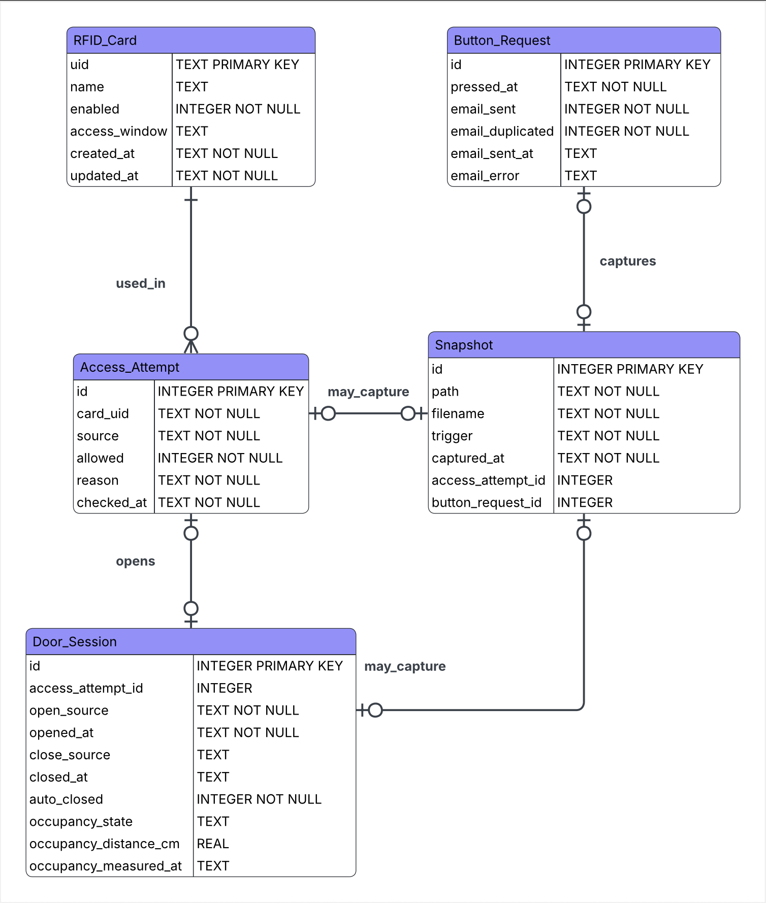

# IOT Locker

Raspberry Pi based smart locker prototype for a parcel locker scenario.

## Project Summary

The project simulates a parcel locker workflow with:

- UID-based RFID door access and card permission management
- A servo-driven locker door
- A CSI camera with a continuous video stream
- Vision-based face detection
- Manual, RFID, face-triggered, and button-triggered snapshots
- An ultrasonic sensor for in-box occupancy detection
- A hardware request button with email notification
- A web dashboard for monitoring and control

## Hardware Summary

- `PN532`: UID-only RFID / NFC scanning, card enrollment, permission-based door access
- `Servo x3`: 1 for door open / close, 2 for camera pan / tilt
- `CSI camera`: OV5647, 5MP, max `2592x1944`, wide-angle lens
- `Ultrasonic sensor`: only used to detect whether the locker contains something
- `Button`: external request button for delivery flow
- `Buzzer`: local and remote alarm output
- `RGB LED`: status indicator

## Wiring Sources

Current wiring references in the repo:

- [wire.pdf](docs/reference/wire.pdf)
- [wire_schem.pdf](docs/reference/wire_schem.pdf)
- [wire.fzz](docs/reference/wire.fzz)

These, together with [config.py](/Users/sunzhuofan/IOT-project/config.py), are the current baseline wiring sources.

## Environment Baseline

- Platform: Raspberry Pi
- Language: Python
- Python version: `3.13`
- Camera stack: CSI camera with `Picamera2`
- Servo PWM stack: `pigpio` daemon + `python3-pigpio` client, with `RPi.GPIO` fallback
- Other GPIO library usage: `RPi.GPIO`
- RFID stack: `PN532` over `I2C` with `adafruit-blinka` + vendored `adafruit_pn532`

## Dependency Strategy

Use `apt` for Raspberry Pi system packages that integrate with the camera stack:

```bash
sudo apt update
sudo apt install -y python3-picamera2
```

Install OpenCV on the Raspberry Pi when you start the vision pipeline:

```bash
sudo apt install -y python3-opencv
```

Install the servo PWM runtime on the Raspberry Pi before using the door servo or
camera pan / tilt servos:

```bash
sudo apt install -y pigpio-tools python3-pigpio
```

On current Debian / Raspberry Pi OS `trixie`, the daemon command comes from
`pigpio-tools`, not a package named `pigpio`.

Use `pip` / `requirements.txt` for project-level Python packages:

```bash
python3 -m venv .venv --system-site-packages
source .venv/bin/activate
pip install -r requirements.txt
```

The `--system-site-packages` flag is important so the virtual environment can see `python3-picamera2` installed by `apt`.

The current websocket vision channel also depends on the `websockets` package
from `requirements.txt`. If the virtual environment was created earlier, rerun:

```bash
source .venv/bin/activate
pip install -r requirements.txt
```

The current repository uses an OpenCV-based vision baseline because it works on the
Raspberry Pi environment without adding another heavy Python wheel.

## PN532 Setup

The current mainline RFID path uses `PN532` in `I2C` mode.

- Minimum wiring: `3.3V`, `GND`, `GPIO2/SDA1`, `GPIO3/SCL1`
- Verify the board is visible on the Pi with `i2cdetect -y 1`
- A healthy baseline usually shows device address `24`
- The project-level reader wrapper is [drivers/pn532.py](/Users/sunzhuofan/IOT-project/drivers/pn532.py)

## Servo PWM Setup

The project now prefers `pigpio` for servo output because it uses hardware-timed
pulses and is much more stable than `RPi.GPIO.PWM` under camera + vision CPU load.

Enable the daemon once so it also starts automatically after reboot:

```bash
sudo systemctl enable --now pigpiod
```

Quick verification:

```bash
python drivers/servo.py
```

Expected output when the hardware-timed backend is active:

```text
Servo backend: pigpio
```

If `pigpio` is unavailable, the driver falls back to `RPi.GPIO` and the output will
show:

```text
Servo backend: rpi_gpio
```

The active servo backend is also exposed at runtime:

- `/api/locker/status` -> `door_servo_backend`
- `/api/stream/meta` -> `camera_mount_status.servo_backends`

## Raspberry Pi Runtime

- Current Raspberry Pi Python environment: `/home/sunzhuofan/Desktop/ParcelBox/.venv/bin/python`
- Example smoke test command on the Pi:

```bash
/home/sunzhuofan/Desktop/ParcelBox/.venv/bin/python scripts/hardware_smoke_test.py camera
```

- Example app start command on the Pi:

```bash
/home/sunzhuofan/Desktop/ParcelBox/.venv/bin/python main.py
```

Then open:

- [http://raspberrypi.local:8000](http://raspberrypi.local:8000)

## Configuration Baseline

A centralized config template now exists in [config.py](/Users/sunzhuofan/IOT-project/config.py).

It already includes placeholders for:

- GPIO pin assignments
- camera defaults
- camera orientation defaults (`hflip` / `vflip`)
- camera mount home angles
- ultrasonic thresholds
- email notification settings
- storage path / database URL

Known baseline values have been filled in `config.py`. GPIO assignments are now present there and should be treated as the current baseline until hardware verification says otherwise.

Current storage baseline:

- Local SQLite database via `sqlite:///iot_locker.db`
- Snapshot directory at `data/snapshots`
- RFID cards stored in SQLite, with `data/cards.json` retained only as a fallback path

Current notification baseline:

- Button-triggered email request notifications are configured in
  [config.py](/Users/sunzhuofan/IOT-project/config.py)
- The email body includes a request-open message and the configured frontend URL
- Duplicate button-triggered email requests are filtered by a cooldown window

## Simplified Database ER Draft

This section is the current recommended business-entity draft for a single-device
deployment. It is intentionally simpler than the current SQLite implementation in
[data/event_store.py](/Users/sunzhuofan/IOT-project/data/event_store.py):

- no separate `device` table because the project currently assumes one physical box
- no separate `user` / `principal` table because there is no account system yet
- no separate `notification_delivery` or `occupancy_measurement` tables in the first pass
- snapshot relations are kept simple with nullable foreign keys instead of a generic link table
- JSON fields are avoided unless a future requirement really needs them
- `access_window` is kept as one compact `TEXT` field instead of being split into multiple columns
- `button_session_id` is not kept because there is no separate `button_session` entity in this model
- `button_request_id` is the only button-side relation field needed on `snapshot`
- `snapshot.source` is omitted in the simplified model; `trigger` is the main snapshot-origin field



### Database Rewrite Flow

The current rewrite assumption is:

- old SQLite files do not need to be migrated
- deleting the old database is acceptable
- the main app should recreate an empty database automatically on startup

Current rewrite sequence:

1. Keep the target schema in [data/schema.sql](/Users/sunzhuofan/IOT-project/data/schema.sql).
2. Let [data/event_store.py](/Users/sunzhuofan/IOT-project/data/event_store.py) create the database from that schema when startup sees no database file.
3. Keep the main runtime writing through the event store so `main.py` can still boot against an empty database.
4. Move any remaining old generic event-style writes toward explicit `rfid_card`, `access_attempt`, `door_session`, `button_request`, and `snapshot` writes as follow-up cleanup.

Current status:

- `storage/` has been merged into `data/`
- schema creation now comes from `data/schema.sql`
- the mainline app path can build a fresh SQLite database automatically

### `rfid_card`

Represents one physical RFID card known to the system.

| Attribute | SQLite type | Meaning | Notes |
| --- | --- | --- | --- |
| `uid` | `TEXT` | Physical RFID UID | Primary key |
| `name` | `TEXT` | Human-readable card label | For example `Front Desk Test Card` |
| `enabled` | `INTEGER` | Whether the card is allowed to be used | Store as `0` / `1` |
| `access_window` | `TEXT` | Allowed time-window rule | Keep as one compact serialized field |
| `created_at` | `TEXT` | Record creation time | Recommended format: UTC ISO-8601 |
| `updated_at` | `TEXT` | Last update time | Recommended format: UTC ISO-8601 |

### `access_attempt`

Represents one card-present event and its authorization result.

| Attribute | SQLite type | Meaning | Notes |
| --- | --- | --- | --- |
| `id` | `INTEGER` | Access-attempt id | Primary key |
| `card_uid` | `TEXT` | Which card UID was presented | Keep as scanned UID text |
| `source` | `TEXT` | Where the attempt came from | Usually `rfid` |
| `allowed` | `INTEGER` | Authorization result | Store as `0` / `1` |
| `reason` | `TEXT` | Why it was allowed or denied | Examples: `granted`, `unknown_card`, `outside_schedule` |
| `checked_at` | `TEXT` | When the decision was made | Recommended format: UTC ISO-8601 |

### `door_session`

Represents one open-to-close door cycle.

| Attribute | SQLite type | Meaning | Notes |
| --- | --- | --- | --- |
| `id` | `INTEGER` | Door-session id | Primary key |
| `access_attempt_id` | `INTEGER` | Attempt that opened the door | Nullable for manual open |
| `open_source` | `TEXT` | How the door was opened | `rfid`, `api`, `auto_close`, etc. |
| `opened_at` | `TEXT` | Door-open timestamp | Start of the session |
| `close_source` | `TEXT` | How the door was closed | Nullable until the door closes |
| `closed_at` | `TEXT` | Door-close timestamp | Nullable until the door closes |
| `auto_closed` | `INTEGER` | Whether the close was automatic | Store as `0` / `1` |
| `occupancy_state` | `TEXT` | Post-close occupancy result | `occupied`, `empty`, or `door_not_closed` |
| `occupancy_distance_cm` | `REAL` | Average measured distance after close | Nullable if no reading was taken |
| `occupancy_measured_at` | `TEXT` | Measurement timestamp | Nullable |

### `snapshot`

Represents one image saved to disk, regardless of what triggered it.

| Attribute | SQLite type | Meaning | Notes |
| --- | --- | --- | --- |
| `id` | `INTEGER` | Snapshot id | Primary key |
| `path` | `TEXT` | Absolute or project-relative saved path | Should point to the local file |
| `filename` | `TEXT` | Snapshot filename | Usually time-based |
| `trigger` | `TEXT` | Why the snapshot was taken | Examples: `manual`, `rfid`, `button`, `vision_face` |
| `captured_at` | `TEXT` | Snapshot timestamp | Business timestamp for the image |
| `access_attempt_id` | `INTEGER` | Related card-attempt id | Nullable |
| `button_request_id` | `INTEGER` | Related button-request id | Nullable |

Extra note:

- Manual snapshots or face-triggered snapshots may legitimately have both relation fields empty.
- `button_session_id` is intentionally omitted here because it would duplicate `button_request_id`.
- `door_session_id` is intentionally omitted in the simplified design because the current
  mainline does not need a separate door-session-to-snapshot link.
- A single snapshot may be attached to an access attempt, a button request, or neither.

### `button_request`

Represents one hardware request-button press.

| Attribute | SQLite type | Meaning | Notes |
| --- | --- | --- | --- |
| `id` | `INTEGER` | Button-request id | Primary key |
| `pressed_at` | `TEXT` | When the button was pressed | Core business timestamp |
| `email_sent` | `INTEGER` | Whether an email was actually sent | Store as `0` / `1` |
| `email_duplicated` | `INTEGER` | Whether sending was suppressed by duplicate filtering | Store as `0` / `1` |
| `email_sent_at` | `TEXT` | Email-send timestamp | Nullable |
| `email_error` | `TEXT` | Last send error | Nullable |

### Relationship Meanings

- `RFID_CARD o|--o{ ACCESS_ATTEMPT`
  - One known RFID card can appear in zero or many access attempts.
  - One access attempt may correspond to zero or one known RFID card row if you keep `unknown_card` scans in the database.
- `ACCESS_ATTEMPT o|--o| DOOR_SESSION`
  - One access attempt may open zero or one door session.
  - One door session may come from zero or one access attempt.
  - The `zero` side exists because manual open is possible.
- `ACCESS_ATTEMPT o|--o| SNAPSHOT`
  - One access attempt may have zero or one snapshot.
  - One snapshot may belong to zero or one access attempt.
- `BUTTON_REQUEST o|--o| SNAPSHOT`
  - One button request may have zero or one snapshot.
  - One snapshot may belong to zero or one button request.

### Design Notes

- Timestamps are recommended as `TEXT` in UTC ISO-8601 format such as
  `2026-03-22T14:30:05Z`.
- SQLite booleans should be stored as `INTEGER` with `0` / `1`.
- `occupancy_distance_cm` is the only field here that clearly benefits from `REAL`.
- `card_uid` on `access_attempt` is intentionally plain `TEXT` instead of a strict foreign key
  if you want to keep denied `unknown_card` scans in the database.
- The simplified first-pass design does not need `payload_json`, `meta_json`, or
  `button_session_id`.
- `access_window` can be JSON text, a compact rule string, or another serialized format,
  but it should stay one application-level field in this simplified model.
- `snapshot.trigger` is intentionally kept even though `snapshot.source` is removed, because
  the current business flow still needs to distinguish manual, RFID, button, and face-triggered captures.

### Recommended SQLite Constraints

- Add `CHECK(enabled IN (0, 1))` to `rfid_card.enabled`.
- Add `CHECK(allowed IN (0, 1))` to `access_attempt.allowed`.
- Add `CHECK(auto_closed IN (0, 1))` to `door_session.auto_closed`.
- Add `CHECK(email_sent IN (0, 1))` and `CHECK(email_duplicated IN (0, 1))`
  to `button_request`.
- Add `UNIQUE(access_attempt_id)` on `door_session` if one access attempt should
  open at most one door session.
- Add `UNIQUE(access_attempt_id)` and `UNIQUE(button_request_id)` on `snapshot`
  if each business action should have
  at most one main snapshot.
- If you want each snapshot to belong to at most one parent, add a `CHECK` that
  no more than one of `access_attempt_id` and `button_request_id`
  is non-null.
- If you want to preserve denied `unknown_card` attempts, keep `access_attempt.card_uid`
  as plain `TEXT` without a strict foreign key.

### How To Read The ER Symbols

Mermaid ER diagrams use endpoint symbols to show cardinality.

- `--`
  - The middle line is just the relationship connector itself.
  - The real meaning comes from the symbols at both ends.
- `|`
  - Means `one`.
- `o`
  - Means `zero` or `optional`.
- The crow's-foot end, rendered like three short lines
  - Means `many`.
  - In Mermaid source this is written as `{` or `}` depending on direction.

Common combinations:

- `||`
  - Exactly one.
- `o|`
  - Zero or one.
- `|{`
  - One or more.
- `o{`
  - Zero or more.

If you read a line like `A ||--o{ B`, it means:

- one `A` can relate to zero or many `B`
- each `B` must relate to exactly one `A`

## Hardware Inputs Still Needed

These still need direct hardware confirmation or measurement:

- ultrasonic empty / occupied threshold calibration
- camera mount home angle calibration

## GPIO Baseline

Current GPIO baseline from [config.py](/Users/sunzhuofan/IOT-project/config.py):

- `PN532`: `I2C` on `/dev/i2c-1`, optional `pn532_reset_pin` / `pn532_req_pin`
- `Door servo`: `GPIO18`
- `Camera pan servo`: `GPIO13`
- `Camera tilt servo`: `GPIO12`
- `Button`: `GPIO27`
- `Buzzer`: `GPIO25`
- `RGB LED Red`: `GPIO5`
- `RGB LED Green`: `GPIO6`
- `RGB LED Blue`: `GPIO26`
- `Ultrasonic trigger`: `GPIO16`
- `Ultrasonic echo`: `GPIO20`

## Current Frontend Direction

- Keep the frontend as a single-device operations console, not a polished showcase site
- Keep the implementation as native `HTML + CSS + JS` without a build step
- Use `Tabler` only as a visual and interaction reference for layout, cards, topbar, and popovers
- Keep the single-page navigation split into:
  - `Overview`
  - `Cards & Access`
  - `Events & Snapshots`
  - `Debug / Data`
  - a local `Settings` view opened from the profile menu
- Show a continuous live video stream at `1280x720` with face boxes and mount advice on the
  `Overview` page
- Keep the high-frequency controls on the homepage: manual door open / close, snapshot capture,
  and RFID enrollment
- Show Raspberry Pi runtime metrics, business summary counts, and recent activity on the homepage
- Keep raw database tables and JSON payloads in `Debug / Data` instead of mixing them into the
  main monitoring view
- Keep a right-side global toolbar with:
  - a `dark mode` toggle
  - an in-page alert bell
  - a profile trigger that opens local settings
- Store current frontend-only preferences in browser `localStorage`:
  - theme choice
  - profile display name / subtitle
  - which high-value in-page alerts appear in the bell
- Do not introduce real login / logout or account persistence until there is an actual account
  model and permission boundary in the backend

## Frontend File Layout

The frontend is no longer maintained as one large `index.html` file. Current structure:

- [frontend/README.md](/Users/sunzhuofan/IOT-project/frontend/README.md) documents the frontend
  split and intended extension points
- `frontend/index.html`
  - page structure, view containers, and semantic content only
- `frontend/styles/theme.css`
  - theme tokens and light / dark palette variables
- `frontend/styles/layout.css`
  - sidebar, workspace, grids, and responsive shell layout
- `frontend/styles/components.css`
  - cards, buttons, tables, popovers, settings view, and notification styles
- `frontend/scripts/dom.js`
  - DOM references only
- `frontend/scripts/state.js`
  - client runtime state and browser storage keys
- `frontend/scripts/formatters.js`
  - shared text / time / status formatters
- `frontend/scripts/renderers.js`
  - view rendering, collection rows, overlay drawing, toast and notification rendering
- `frontend/scripts/api.js`
  - backend `fetch` helpers and refresh actions
- `frontend/scripts/app.js`
  - bootstrap, event binding, theme switching, settings persistence, WebSocket, and polling

## Current Runtime Status

- `main.py` starts a minimal FastAPI app
- `frontend/index.html` now acts as a structured single-page operations console with split
  `Overview`, `Cards & Access`, `Events & Snapshots`, `Debug / Data`, and local `Settings` views
- `/api/stream.mjpg` provides the MJPEG stream
- `/ws/vision` now pushes vision results over WebSocket
- `/api/vision/boxes` remains as a latest-payload debug snapshot endpoint
- `/api/stream/meta` returns stream, detection, locker, camera-mount, and button status
- `/api/system/status` returns Raspberry Pi runtime metrics such as hostname, CPU temperature,
  CPU / memory usage, load average, platform, and app uptime
- Current runtime defaults: `720p`, `30 fps` active stream, `10 fps` standby stream,
  `15 fps` active face-detection loop, `3 fps` standby detection loop, JPEG quality `70`
- The MJPEG stream now uses one shared cached JPEG frame for all clients instead of
  re-capturing and re-encoding per viewer
- `CameraService` now recreates the camera cleanly after stop / start and can lower
  the main-stream FPS when the vision pipeline enters standby
- `VisionService` now runs on its own background detection thread and only keeps the
  latest payload instead of queueing stale boxes
- `VisionService` now uses a pluggable backend and currently defaults to an OpenCV-based
  face-detection baseline
- Current face baseline prefers `YuNet` when the ONNX model is present, and falls back to
  `Haar` when the model is missing or the OpenCV build does not support it
- `VisionService` mainline is now face-only and keeps a short `face_hold` prediction
  window for brief misses
- The primary face box is smoothed before it reaches the frontend overlay and camera
  mount controller
- The frontend global toolbar now supports:
  - local `dark mode`
  - a high-value alert bell for button presses, denied RFID attempts, and close-range face
    snapshot events
  - a profile popover that opens a local browser-backed settings view
- After the mount finishes a face-lost recovery cycle and still sees no face for long
  enough, vision enters a low-FPS standby mode and exits immediately when a face returns
- Large enough faces can now trigger one automatic snapshot until the face disappears
- Camera orientation can now be set in [config.py](/Users/sunzhuofan/IOT-project/config.py)
  with `config.camera.hflip` and `config.camera.vflip`
- `LockerService` now runs a background RFID worker, processes UID-only card scans,
  opens the door on authorized cards, records denied scans, auto-closes after a delay,
  and attaches snapshots to accepted RFID card-present events
- `ButtonService` now watches the request button, saves a local snapshot, and triggers an
  email open-request notification with duplicate filtering

## Vision Baseline

- Current runtime uses a `1280x720` stream for frontend display
- Use a separate `640x360` inference resolution for vision tasks
- Current detection backend is `OpenCV`
- Current recommended face detector is `YuNet`
- Current vision mainline is face-only; it no longer runs person detection or `auto`
  person-to-face switching
- Short face misses can be bridged by a small `face_hold` prediction window to reduce
  visible jitter
- The primary face box is blended with EMA smoothing before building the frontend / mount target
- After the post-search / post-home no-face delay expires, detection drops to standby FPS
  without changing resolution
- Save clear snapshots from the higher-quality camera output, not from the low-resolution inference frames
- Current automatic face snapshot trigger uses face-box area ratio instead of a
  multi-frame sharpness scoring pipeline

## Vision Models

Default local model paths are configured in [config.py](/Users/sunzhuofan/IOT-project/config.py):

- `models/face_detection_yunet_2023mar.onnx`

The current OpenCV backend can use:

- `YuNet` for face detection
See [models/README.md](/Users/sunzhuofan/IOT-project/models/README.md).

## Detection Notes

The current mainline keeps `YuNet` for face detection because it gives a good balance
of accuracy, speed, and dependency simplicity on Raspberry Pi 4.

Other routes were not enabled in the mainline:

- `YOLO` / `YOLOX` added more runtime and dependency cost than value for the current Raspberry Pi setup
- `TFLite` added Python runtime friction on the current environment and was not kept on the main path

## Camera Orientation

Camera flip is now handled in the camera pipeline instead of frontend CSS. The same
orientation therefore applies to:

- frontend live stream
- detection frames
- saved snapshots

Current config switches:

- `config.camera.hflip`
- `config.camera.vflip`

Typical use:

- left / right mirrored image: `hflip=True`
- upside-down image: `vflip=True`
- 180-degree rotation: both `True`

## Module Boundaries

### `drivers/`

Direct hardware access only.

- No business logic
- No HTTP
- No database logic
- Keep APIs simple and device-focused

Examples:

- `PN532Reader.read_uid_hex()`
- `Servo.set_angle()`
- `CsiCamera.capture_frame()`
- `UltrasonicSensor.measure_distance_cm()`

### `services/access_service.py`

RFID and permission logic only.

- card enrollment
- card naming
- access permission rules
- time-based access checks

Current implementation note:

- Cards now persist to SQLite in the mainline app.
- The access service can enroll cards, rename / rebind them, enable or disable them, and apply simple weekday + time-window checks.

### `services/locker_service.py`

Locker workflow orchestration.

- open / close door flow
- bind access result to door events
- trigger occupancy check after close
- link snapshots to door events

Current implementation note:

- The locker service now runs a background RFID worker, opens the door on authorized scans,
  rejects unknown or disabled cards, supports manual `/api/locker/open` and `/api/locker/close`,
  auto-closes after a delay, and records events to SQLite while still exposing a recent-event view.

### `services/camera_service.py`

Camera device orchestration.

- stream lifecycle
- camera parameter changes
- parameter persistence
- raw snapshot capture
- JPEG encoding for MJPEG output
- shared cached JPEG frame for multiple viewers

Current implementation note:

- The camera service can switch the live-stream FPS between normal and standby targets.
- On Raspberry Pi / Picamera2, it also updates `FrameDurationLimits` so the main stream
  itself slows down instead of only throttling MJPEG output.

### `services/vision_service.py`

Vision understanding only.

- face detection
- tracking target state
- clear-frame scoring
- output boxes and tracking data

Current implementation note:

- The current mainline uses real OpenCV-based face detection only.
- Short face misses can be bridged by a small predicted `face_hold` window before the
  target is cleared.
- The primary face box is EMA-smoothed before it is mapped to stream coordinates.
- Standby timing is now anchored to the camera-mount recovery flow, so the detector only
  drops to low FPS after face-loss search and home have finished and the scene remains empty.
- Face-triggered automatic snapshots are latched per visible face-presence window and
  reset after faces disappear from the frame.

### `services/camera_mount_service.py`

Pan / tilt servo orchestration for the camera mount.

- standby angles
- target tracking
- face-loss recovery search
- return-to-home behavior

Current implementation note:

- The current mount service tracks `face` targets only, publishes pan / tilt advice to
  the frontend, enforces angle limits during normal tracking, and returns home when
  face tracking is lost or when the no-face idle timer fires.
- On face loss, it now waits briefly, runs an interruptible horizontal recovery sweep
  with tilt pinned to `tilt_home_angle`, then returns home if no face was recovered.
- Search and home moves both run with the `home_step` / `home_delay` profile, while
  normal tracking still uses its own step / delay and single-move angle caps.

### `services/button_service.py`

Hardware request-button orchestration.

- watch button presses
- capture a local snapshot on press
- trigger open-request notification callbacks
- expose the latest button event to the frontend / API

### `services/email_service.py`

Outbound request-notification logic only.

- build open-request email content
- include frontend dashboard URL in the message body
- filter duplicate requests with a cooldown
- keep last send result / error for inspection

### `services/occupancy_service.py`

Locker occupancy logic based on ultrasonic readings.

- distance sampling
- average calculation
- empty / occupied classification
- threshold calibration

Current implementation note:

- Closing the door now triggers an immediate occupancy measurement when the ultrasonic sensor is available.
- The current rule is:
  - `distance <= occupied_threshold_cm` -> `occupied`
  - `distance > occupied_threshold_cm` and door `closed` -> `empty`
  - `distance > occupied_threshold_cm` and door `open` -> `door_not_closed`

### `web/`

API and real-time outputs only.

- no direct GPIO access
- no direct database writes outside services
- call services and return structured responses

Recommended split:

- `routes_control.py`
- `routes_stream.py`
- `routes_cards.py`
- `routes_logs.py`
- `schemas.py`

### `data/`

Persistence layer only.

- SQLite schema bootstrap
- event persistence
- card / snapshot / attempt queries

Suggested initial entities:

- users
- cards
- card_user_bindings
- card_access_rules
- enrollments
- door_events
- snapshots
- snapshot_event_links
- video_settings
- camera_mount_settings
- occupancy_settings
- alarm_events

## Suggested Structure

```text
iot_locker/
├─ README.md
├─ TODO.md
├─ requirements.txt
├─ main.py
├─ config.py
├─ data/
│  ├─ event_store.py
│  └─ schema.sql
├─ drivers/
│  ├─ pn532.py
│  ├─ adafruit_pn532/
│  ├─ servo.py
│  ├─ button.py
│  ├─ ultrasonic_sensor.py
│  ├─ buzzer.py
│  ├─ rgb_led.py
│  └─ camera.py
├─ services/
│  ├─ access_service.py
│  ├─ button_service.py
│  ├─ buzzer_service.py
│  ├─ camera_service.py
│  ├─ camera_mount_service.py
│  ├─ email_service.py
│  ├─ led_service.py
│  ├─ locker_service.py
│  ├─ occupancy_service.py
│  ├─ system_status_service.py
│  ├─ vision_backends.py
│  └─ vision_service.py
├─ web/
│  ├─ routes_cards.py
│  ├─ routes_control.py
│  ├─ routes_logs.py
│  ├─ routes_stream.py
│  ├─ routes_system.py
│  └─ schemas.py
├─ frontend/
│  ├─ README.md
│  ├─ index.html
│  ├─ styles/
│  │  ├─ components.css
│  │  ├─ layout.css
│  │  └─ theme.css
│  └─ scripts/
│     ├─ api.js
│     ├─ app.js
│     ├─ dom.js
│     ├─ formatters.js
│     ├─ renderers.js
│     └─ state.js
├─ scripts/
│  └─ hardware_smoke_test.py
└─ tests/
   └─ test_*.py
```

## Core Runtime Flows

### Access Flow

`PN532 -> access_service -> locker_service -> servo -> storage`

Current implementation note:

- The current mainline stores RFID cards, event logs, and snapshots in SQLite.
- `cards.json` is kept only as a fallback path and is not the primary store in the app path.

## Verification

The current repository has unit-level coverage for the mainline hardware orchestration
and storage flows.

Useful local checks:

```bash
./.venv/bin/python tests/test_phase3_services.py
./.venv/bin/python tests/test_pn532_driver.py
./.venv/bin/python tests/test_event_store.py
./.venv/bin/python tests/test_button_service.py
./.venv/bin/python tests/test_camera_mount_service.py
./.venv/bin/python tests/test_vision_service_face_only.py
./.venv/bin/python tests/test_vision_service_snapshot.py
```

Useful Raspberry Pi smoke tests:

```bash
./.venv/bin/python scripts/hardware_smoke_test.py camera
./.venv/bin/python scripts/hardware_smoke_test.py pn532
./.venv/bin/python main.py
```

### Vision Flow

`camera -> vision_service -> camera_mount_service -> frontend overlays / snapshots`

### Button Request Flow

`button -> button_service -> snapshot + email_service -> frontend notification`

### Occupancy Flow

`ultrasonic_sensor -> occupancy_service -> locker_service -> storage`

## Settings That Should Persist

- video resolution
- frame rate
- brightness
- sharpness
- saturation
- camera mount home angles
- occupancy thresholds
- email notification settings / frontend URL

## Notes

- CSI camera support is based on `Picamera2`
- Prefer installing `python3-picamera2` with `apt` on Raspberry Pi
- The current RFID mainline uses `PN532` over `I2C`; `SPI` remains a future fallback option
- If the ultrasonic sensor uses a `5V` echo pin, add voltage division before connecting to Raspberry Pi GPIO
- `config.py` is the current baseline config entry for Phase 0
- `scripts/hardware_smoke_test.py` is the shared entry point for Phase 1 device checks
