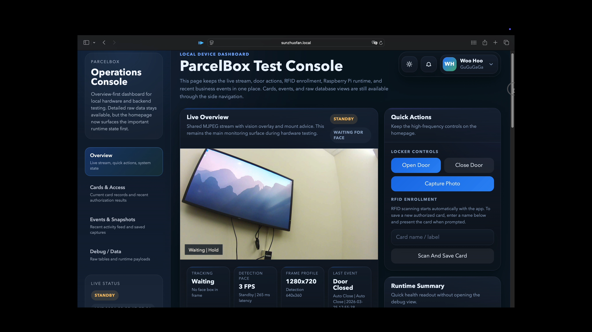
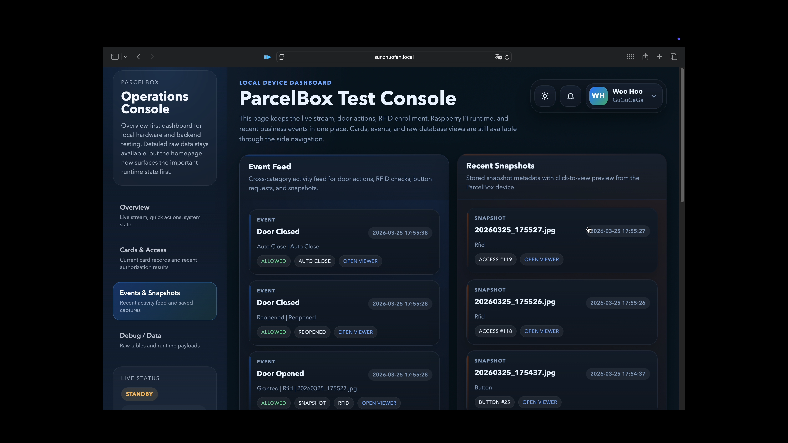
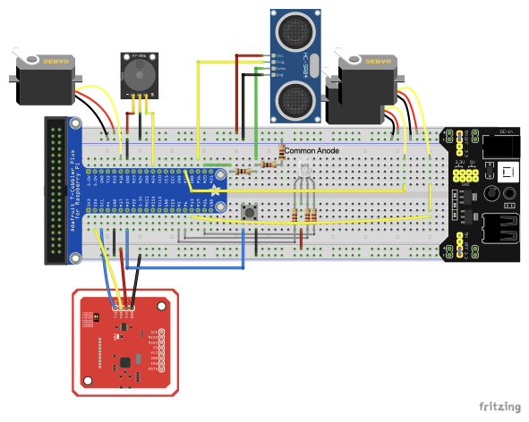

# ParcelBox

ParcelBox is a Raspberry Pi smart parcel box prototype. It combines RFID access control, locker door actuation, live camera streaming, face detection with pan-tilt tracking, ultrasonic occupancy sensing, local audio/visual alerts, SQLite persistence, and a browser-based operations console into one device-side system.



## Project Overview

The point of this project is not just to build a web page. It is to close the loop across a real hardware workflow:

- Read RFID cards and decide whether access should be granted
- Lock and unlock the compartment with a servo-driven door mechanism
- Provide live video, snapshots, and visual overlays from a CSI camera
- Detect faces, track them with a pan-tilt mount, recover from target loss, and drop into standby when idle
- Trigger door-open requests, email notifications, and local alarms from a physical button
- Persist cards, access attempts, door sessions, button requests, snapshots, and email schemes in local SQLite storage
- Expose the whole system through a browser console for monitoring, control, and debugging

This repository is scoped as a single-device prototype, not a cloud platform. The vision stack focuses on face detection and tracking rather than face recognition. Video delivery is handled with MJPEG plus WebSocket metadata instead of WebRTC.

## Team

- Zhuofan Sun - GitHub: [ZhuofanSun](https://github.com/ZhuofanSun)
- Jiayin Chen - GitHub: [Yinnc259](https://github.com/Yinnc259)
- Yangfei Wang - GitHub: [stayinnight1](https://github.com/stayinnight1)

## Showcase

### Events and Snapshots View

The homepage is meant for live status and quick control. The events and snapshots views are better for reviewing RFID activity, button requests, door sessions, and captured images.



### Hardware Wiring

The locker control hardware, camera mount, RFID reader, button, RGB LED, buzzer, and ultrasonic sensor are all wired around the Raspberry Pi. The following image is the most practical overall wiring reference for the prototype.



If you want the schematic-style version, see [`docs/reference/wire_schem.png`](docs/reference/wire_schem.png).

## Core Capabilities

- Single-device integration: frontend, backend, drivers, and storage all run on the Raspberry Pi
- RFID access control: card enrollment, enable/disable state, and time-window authorization
- Locker workflow: open, close, auto-close, and post-close occupancy measurement
- Vision tracking: dual camera streams, low-resolution detection, high-resolution display, mount tracking, and standby mode
- Event capture: manual snapshots, RFID-triggered snapshots, button-triggered snapshots, and near-face snapshots
- Local alerts: unauthorized scans and repeated button presses can escalate to buzzer alarms and search behavior
- Browser operations console: live monitoring, event review, snapshot browsing, and device settings in one place

## Tech Stack

- Hardware: Raspberry Pi, PN532 RFID reader, CSI camera, 3 servo channels, ultrasonic sensor, button, RGB LED, buzzer
- Backend: FastAPI, Uvicorn, SQLite
- Vision: Picamera2, OpenCV, YuNet / Haar Cascade
- Frontend: plain HTML, CSS, and JavaScript
- Device control: `pigpio`, `RPi.GPIO`, Adafruit Blinka / PN532

## System Architecture

The repository is organized into five layers: browser console, web routes, core services, local data, and hardware drivers. `main.py` wires these services together at startup and exposes them through FastAPI.


The browser-to-device communication model is also intentionally simple:

- HTTP API for commands, settings writes, and polling-based status refresh
- MJPEG for the live video stream
- WebSocket for vision boxes, tracking state, button events, and other real-time overlay metadata


## Main Workflows

### 1. RFID Unlock Flow

`LockerService` continuously polls `AccessService` in the background. When `AccessService` reads a UID from the PN532 reader, it normalizes the UID and evaluates whether the card exists, whether it is enabled, and whether the current time is inside the configured access window.

- If access is granted: record the result, capture a snapshot, drive the door servo open, and start the auto-close timer
- If access is denied: record the denied event, optionally attach a snapshot, and pass the event to `AlertService` for buzzer and escalation handling
- After the door closes: `OccupancyService` measures distance and classifies the locker as `occupied`, `empty`, or `door_not_closed`


### 2. Vision Detection and Pan-Tilt Tracking

`CameraService` maintains both the main stream and the lower-resolution detection stream. `VisionService` runs face detection on the detection stream, maps the boxes back to display resolution, and pushes the payload to the frontend over WebSocket. `CameraMountService` uses target offsets to drive the pan and tilt servos.

- Face detected: smooth the box, update the target center, and move the mount
- Face briefly lost: use short-term prediction to reduce visible jitter
- Face lost for longer: enter a recovery/search sweep, then return home if recovery fails
- No face for a while: drop to low-FPS standby mode to reduce idle load
- Face close enough to the camera: capture a one-time near-face snapshot


### 3. Button, Notifications, and Event Flow

The system also maintains a separate hardware-button workflow:

- `ButtonService` listens to the GPIO button and can capture a snapshot and request an email notification
- `EmailNotificationService` sends a door-open request email using the currently enabled delivery scheme and applies duplicate suppression
- `AlertService` tracks burst conditions for rapid button presses and repeated unauthorized RFID scans
- `BuzzerService` and `LedService` provide local feedback
- `EventStore` consolidates button requests, snapshots, access attempts, and door sessions into SQLite for the frontend event and debug views

## Local Data Model

Runtime state is persisted in local SQLite storage. The main entities are:

- `rfid_card`: enrolled cards and their access rules
- `access_attempt`: the authorization result of each scan
- `door_session`: the full lifecycle of each open/close session
- `button_request`: button-triggered open requests and email delivery outcomes
- `snapshot`: captured images and their parent relationships
- `device_profile`: local console name, role, and avatar
- `email_subscription_scheme` / `email_subscription_recipient`: outbound email schemes and recipients

That means the card list, event feed, snapshot viewer, settings page, and debug tables in the browser are all reading from the same local source of truth.

## Project Structure

| Path | Role |
| --- | --- |
| `main.py` | Application entry point, service wiring, and FastAPI lifecycle setup |
| `config.py` | Central runtime configuration for GPIO, camera, mount, door, alerts, vision, web, and storage |
| `services/` | Business logic and background workers for RFID, locker control, vision, button handling, alerts, email, LEDs, and more |
| `web/` | FastAPI route layer for HTTP APIs, MJPEG streaming, and the vision WebSocket |
| `frontend/` | Static single-page console served directly by FastAPI, with no separate build step |
| `data/` | SQLite schema, `EventStore`, and snapshot path handling |
| `drivers/` | Low-level wrappers for the camera, PN532, servos, button, ultrasonic sensor, RGB LED, and buzzer |
| `scripts/` | Hardware smoke tests, Raspberry Pi sync scripts, runtime data pull scripts, and one-off migrations |
| `models/` | Vision model directory; the YuNet ONNX model is loaded from here by default |
| `docs/reference/` | UI screenshots, architecture diagrams, workflow diagrams, wiring references, and course materials |

If you want the fastest route through the codebase, this reading order works well:

1. `main.py`
2. `config.py`
3. `services/locker_service.py`
4. `services/access_service.py`
5. `services/camera_service.py`
6. `services/vision_service.py`
7. `services/camera_mount_service.py`
8. `data/event_store.py`
9. `web/routes_*.py`
10. `frontend/scripts/app.js`

## Key Modules

| Module | Responsibility |
| --- | --- |
| `AccessService` | RFID reads, card enrollment, and time-window authorization checks |
| `LockerService` | Scan processing, door state transitions, auto-close, and occupancy integration |
| `CameraService` | Camera initialization, shared stream frames, and snapshot capture |
| `VisionService` | Face detection, box smoothing, standby behavior, and near-face snapshot capture |
| `CameraMountService` | Home positioning, tracking, recovery, and search sweeps for the pan-tilt mount |
| `ButtonService` | Button listening, snapshot capture, and notification triggering |
| `AlertService` | Escalation logic for unauthorized scans and burst button activity |
| `EmailNotificationService` | Runtime email delivery for open requests and test emails |
| `EventStore` | SQLite persistence for cards, events, snapshots, settings, and email schemes |

## Runtime Boundaries

There are a few boundaries worth stating clearly:

- This is a single-device prototype, not a cloud multi-device platform
- Video uses MJPEG plus WebSocket because simplicity and stability matter more here than bandwidth efficiency
- Vision is limited to face detection and tracking, not identity recognition
- The frontend is plain static web content with no separate frontend build pipeline
- The best target environment is Raspberry Pi OS with working camera and GPIO access

## Before You Run It

Before starting the application, confirm the following:

- Raspberry Pi OS has camera and GPIO access enabled
- The hardware wiring matches the GPIO assignments in `config.py`
- `pigpiod` is available for stable servo control
- If you want YuNet, the model file exists at `models/face_detection_yunet_2023mar.onnx`
- If the YuNet model is missing, the OpenCV backend will fall back to Haar Cascade

## Installation and Startup

Install the Raspberry Pi system packages first:

```bash
sudo apt update
sudo apt install -y python3-picamera2 python3-opencv pigpio-tools python3-pigpio
```

Create a virtual environment and install the Python dependencies:

```bash
python3 -m venv .venv --system-site-packages
source .venv/bin/activate
pip install -r requirements.txt
```

`Picamera2` is installed as a system package, so the virtual environment keeps `--system-site-packages`.

Start `pigpiod`:

```bash
sudo systemctl enable --now pigpiod
```

If you want to run a quick hardware smoke test first:

```bash
./.venv/bin/python scripts/hardware_smoke_test.py all
```

Start the application:

```bash
./.venv/bin/python main.py
```

Then open the dashboard in a browser:

- `http://raspberrypi.local:8000`
- `http://<pi-lan-ip>:8000`

## Sync and Deploy to the Raspberry Pi

If you are developing on another machine and want to push the project to the Raspberry Pi, use the built-in sync script:

```bash
./scripts/sync_to_pi.sh
```

If you want to pull runtime data back from the Raspberry Pi, including the SQLite database and snapshots:

```bash
./scripts/pull_runtime_data_from_pi.sh
```

Both scripts support environment-variable overrides for the target host and path:

```bash
PI_HOST=<your-pi-host> PI_USER=<your-pi-user> PI_PORT=22 REMOTE_DIR=<remote-path> ./scripts/sync_to_pi.sh
```
